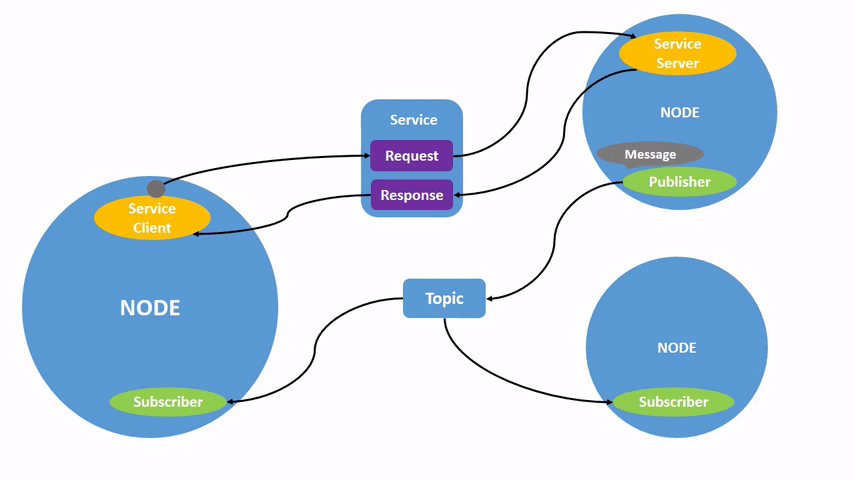

# Keynotes for ROS2
* Refer to [here](./FreqUseCmd.txt) for cli of ros2
* ROS2 uses term `Workspace` to indicate your devel location - [link](https://docs.ros.org/en/foxy/Tutorials/Configuring-ROS2-Environment.html#background)
* No more 'roscd' - [Why?](https://answers.ros.org/question/277801/ros2-roscd-feature/)
    * **_NOTE:_** If needed, refer to [colcon_cd](https://github.com/colcon/colcon-cd)
* ROS2 use [DDS](http://en.wikipedia.org/wiki/Data_Distribution_Service)
* Replace `ROS_HOSTNAME/ROS_MASTER_URI` with `ROS_DOMAIN_ID` (0-101 and 215-232) - [see more](https://docs.ros.org/en/foxy/Concepts/About-Domain-ID.html)
    * **_NOTE 1:_** Running more than 120 ROS2 processes on one computer may spill over into other domain IDs or the ephemeral ports

    * **_NOTE 2:_** Maximum number of processes that should be created when using domain ID 101 on Linux is 54

* Message type is structured as `<pkg>/<type (msg/srv/act)>/<name>` - see [sample here](https://docs.ros2.org/foxy/api/test_msgs/index-msg.html)
* `rqt_console` - GUI tool to introspect logs
    * Use `--ros-args --log-level <level>` to filter logs of `ros2 run`
    * `<level>`: could be one of `Fatal/Error/Warn/Info/Debug`
* Launch file is now written in python3 - sample [here](./turtlesim_launch/turtlesim_mimic_launch.py)
* `--ros-args --remap <from>:=<to>` - using this to reassign default node properties when running new node
* `catkin_make` is replaced by `colcon build`
* Add place an empty file named `COLCON_IGNORE` in the pkg dir to ignore building it
 
## Build pkg - see [here](https://docs.ros.org/en/foxy/Tutorials/Colcon-Tutorial.html#basics) for more details
1. Create workspace
``` bash
mkdir <colcon_ws>
```
2. Create source
``` bash
mkdir -p <colcon_ws>/src
```
3. Put your source code in `<colcon_ws>/src`
4. Navigate to *colcon_ws* root dir
``` bash
cd <colcon_ws>
```
5. Check dependencies
``` bash
rosdep install -i --from-path <src> --rosdistro <ros_dist> -y
```
6. Build pkg
``` bash
colcon build --symlink-install
```
7. New dir is created `build`, `install` & `log` dir -> source overlay to add pkg to current active env
``` bash
# if ros2 underlay has been sourced, then use 'local_setup.bash' file
. install/local_setup.bash

# if ros2 underlay has NOT been sourced, then use 'setup.bash' file (same as sourcing 2 files above)
. install/setup.bash
```
> _**NOTE:**_ Pkgs of 'overlay' whose name is the same as existing pkgs in ros2 'underlay' will override pkgs in 'underlay'
8. Done. Now new pkg can be used as usual: `ros2 run <new_pkg> <<exec_name>>`

# Architecture
## Node
* ROS comprised of nodes
* Each node do 1 or more specific functions
* Nodes communicate with each other using various type of messages

## Message
* 3 types of messages: Topic, Service, Action
### Topic
* Working in Publisher-Subcriber manner

### Service
* Working in Server-Client manner

### Action
* Mix of Pub-Sub & Ser-Cli


# References
Documentation: https://docs.ros.org/en/foxy/
API: https://docs.ros2.org/foxy/api/
Tutorial repo: https://github.com/ros/ros_tutorials/tree/foxy-devel